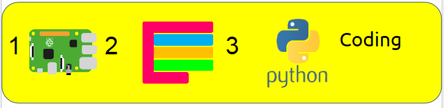
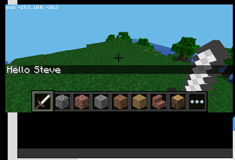
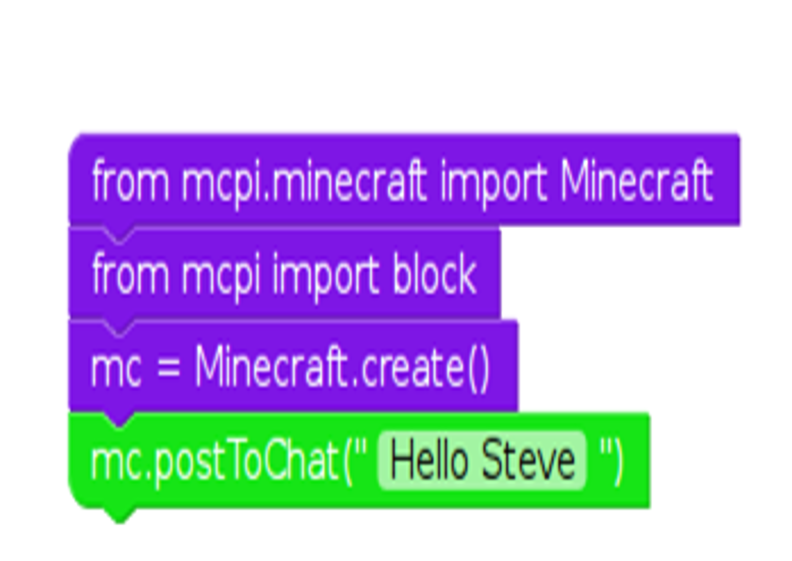
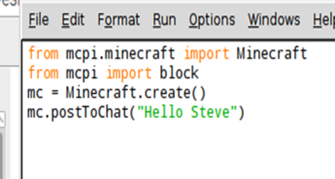

# 1, 2, 3 Coding: Minecraft: Hello Steve

## Why 1,2,3?

+This is the first example of 1, 2, 3 coding cards. EduBlocks allows you to simply create Python code in a drag and drop environment. In this first exercise we will use Python to send a message to in game chat window. We will then create the exact same mod using Python 3 whuch is a text based programming language. 

Step 1: Grab a Pi
Step 2: Master visual coding with EduBlocks
Step 3: Learn how to create the same mod with text based code with Python 3.

## Getting started 

1. Open EduBlocks from the Desktop icon.
1. Click on the Minecraft coding tab on the left handside

## In action

## Open EduBlocks

## The EduBocks code

## The Python code

